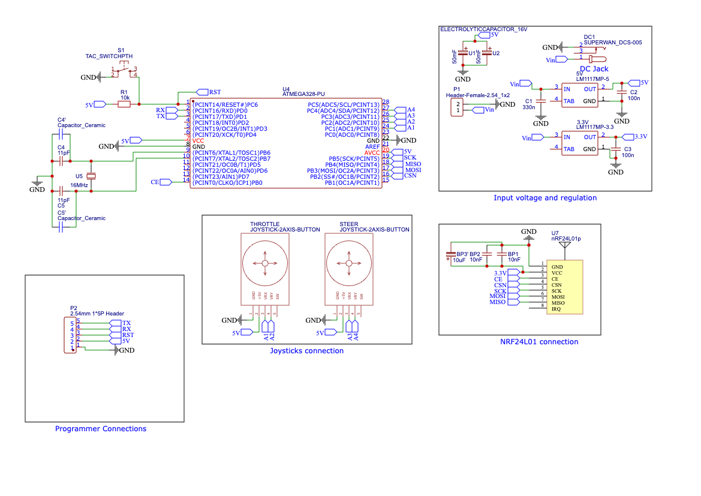

# RC Car Project

This repository contains the code and PCB designs for an RC car built using the ATmega328 microcontroller and programmed using the Arduino IDE. The project was a collaborative effort between myself and my friend Hushki.

## Project Overview

The RC car project involved building both the car itself and the RC controller. I was responsible for designing the PCB and writing the code for the car, while Hushki designed the PCB and wrote the code for the RC controller. The car is controlled wirelessly using the RC controller, allowing for remote control of its movement.

## Features

- Remote control of the car using the RC controller
- Forward, backward, left, and right movement controls
- Real-time control and response for smooth driving experience
- Customizable and expandable design for further enhancements

## Repository Structure

```
├── code
│   └── car_code.ino               # Arduino code for the RC car
│   └── controller_code.ino        # Arduino code for the RC controller
├── pcb_design
│   └── car_pcb_design.fzz          # Fritzing file for the car PCB design
│   └── controller_pcb_design.fzz   # Fritzing file for the controller PCB design
├── images
│   └── car_schematic.png          # Schematic diagram of the car
│   └── car_pcb.png                # PCB design of the car
│   └── controller_schematic.png   # Schematic diagram of the controller
│   └── controller_pcb.png         # PCB design of the controller
│   └── car_real_photo1.jpg        # Real photo of the RC car
│   └── car_real_photo2.jpg        # Real photo of the RC car
│   └── controller_real_photo.jpg   # Real photo of the RC controller
└── README.md                      # Documentation file (you are here)
```

## Schematics

### RC Car Schematic


### RC Controller Schematic


## PCB Designs

### RC Car PCB Design


### RC Controller PCB Design


## Real Photos

### RC Car


### RC Controller


## How to Use

1. Clone the repository: `git clone https://github.com/emad555/rc_car.git`
2. Upload the `car_code.ino` file to the ATmega328 microcontroller in the RC car.
3. Upload the `controller_code.ino` file to the ATmega328 microcontroller in the RC controller.
4. Assemble the RC car and RC controller according to the provided PCB designs.
5. Power on the car and the controller.
6. Use the RC controller to wirelessly control the movements of the RC car.

Feel free to customize and modify the code and PCB designs to suit your specific requirements.

## Acknowledgements

We would like to thank the Arduino community for their valuable resources and the EasyEDA project for providing an excellent platform for designing the PCBs.

## Contributors

- [Emad](https://github.com/emad555)
- [Hushki](https://github.com/hushki)

Please feel free to contribute to this project by submitting pull requests or opening issues for improvements or bug fixes.

## License

This project is released under the [MIT License](LICENSE), which allows for free and open use, modification, and distribution of the project.
